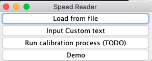
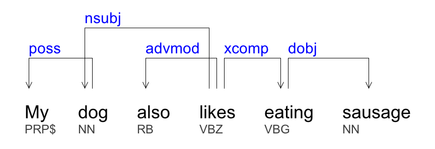
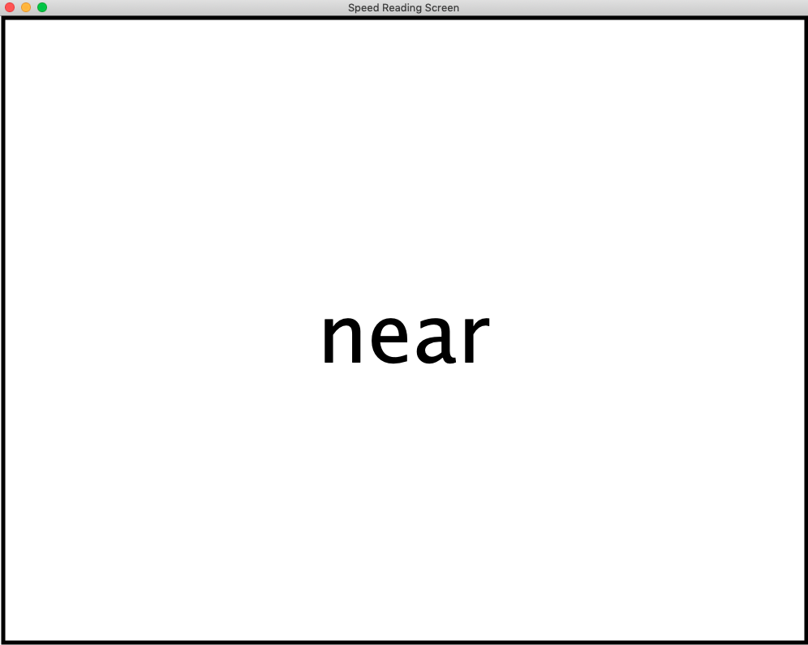

## Speed Reader
This repo contains the code for my Speed Reader project. An extensive explanation of this program can be found on my blog [here](https://dsiegler2000.github.io/java/other%20work/2019/09/08/speed-reader.html). Basically, it uses the Stanford NLP parser to determine which words in a sentence are least important and remove those words. It then shows the edited sentence word by word, which is a technique that has been shown to improve reading speed while maintaining comprehension. Thus, this program allows you to read less words at a faster pace.

The program has a basic GUI. This is the home screen.

This is an example of the Stanford NLP library parsing a sentence.

This is the main reading screen. 
